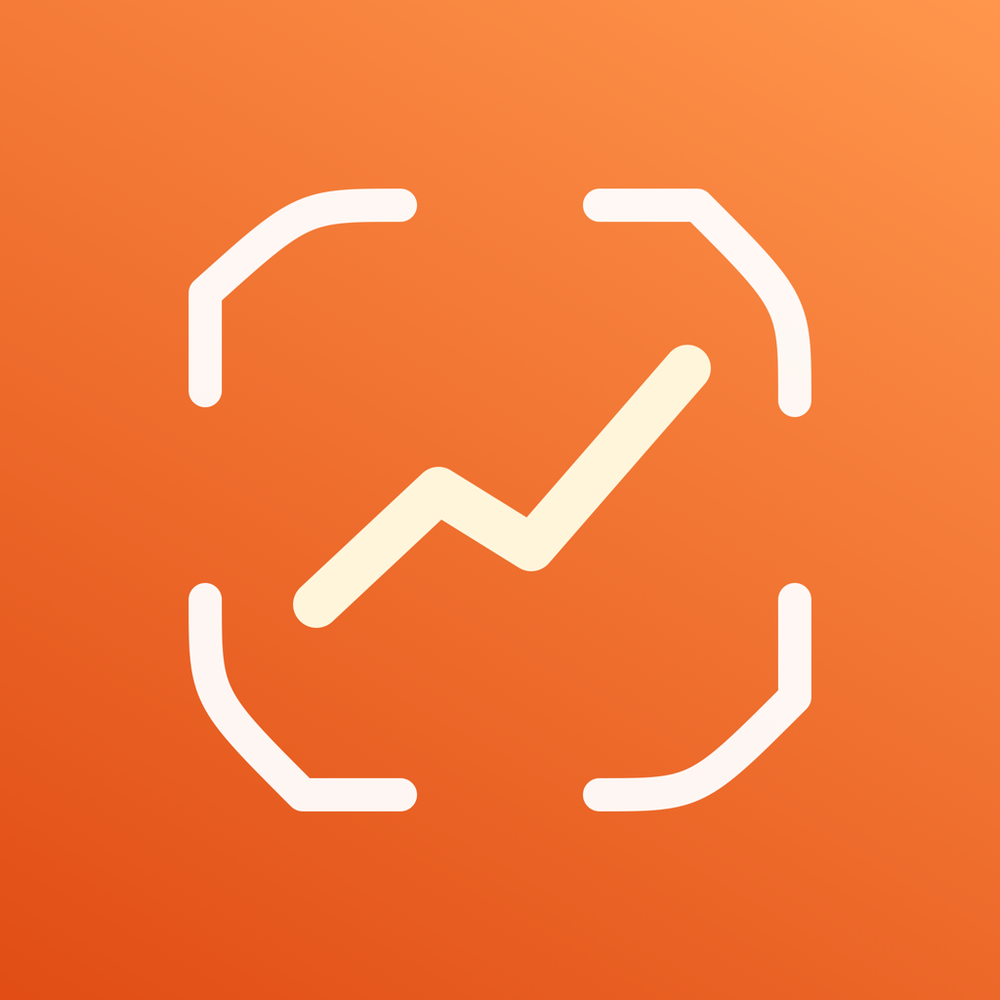
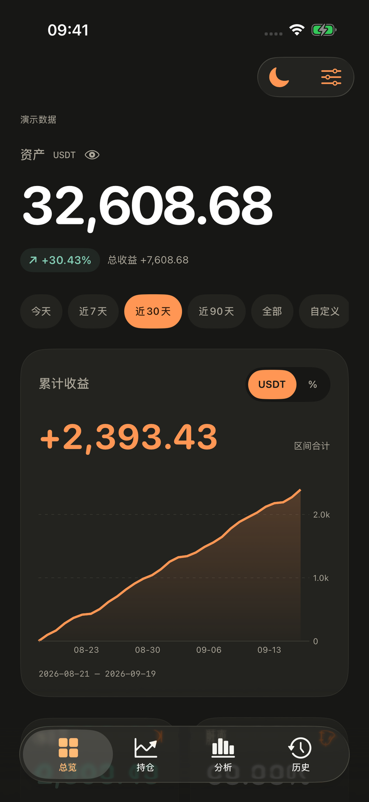
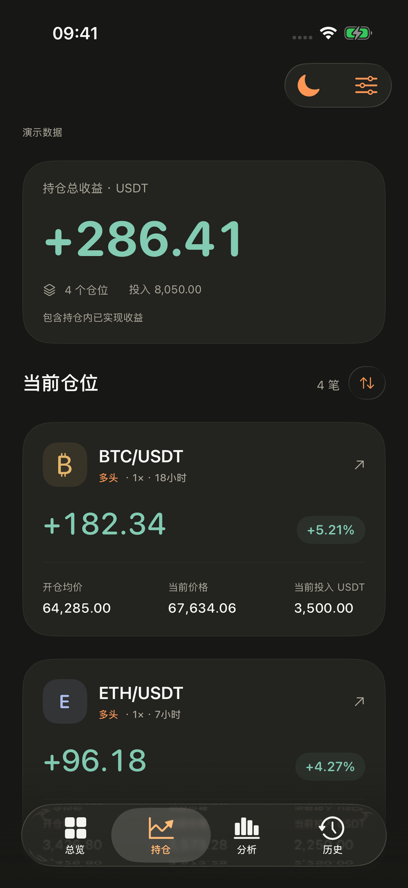
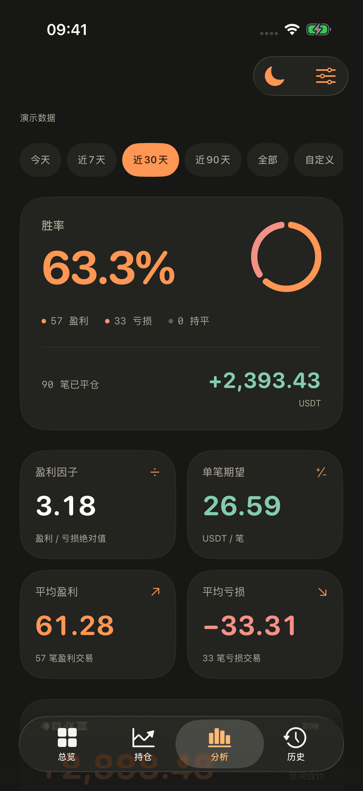
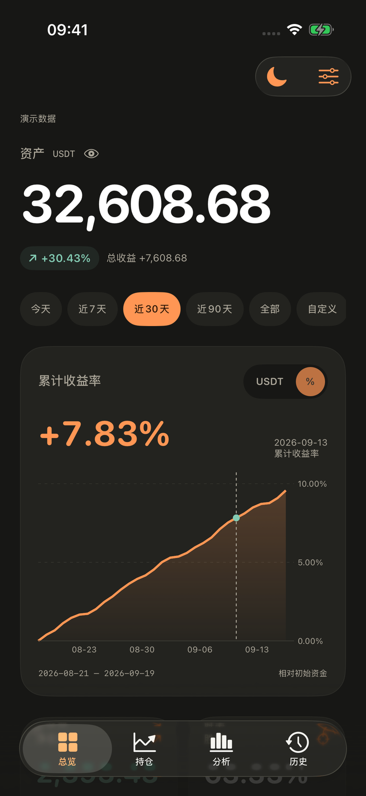
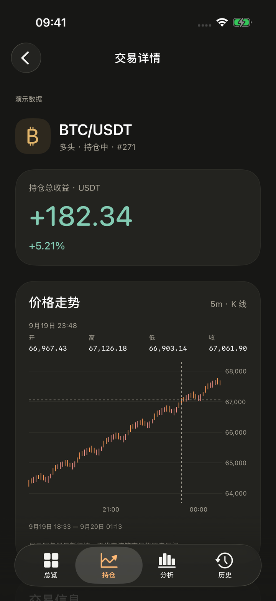
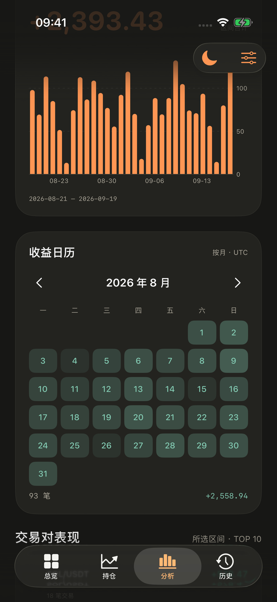

<p align="center">
  <a href="FreqLens/Assets.xcassets/AppIcon.appiconset/AppIcon.png"></a>
</p>

# Freq Lens

**在 iPhone 上查看你的 Freqtrade 数据。**

用原生 SwiftUI 和 Swift Charts 构建的数据查看中心：收益、持仓、胜率、月历和交易历史，一处查看。暖深色背景、橙色重点数据、系统 Liquid Glass 导航，默认深色，也支持浅色与跟随系统。

**iOS 26+ · iPhone · SwiftUI · Swift Charts · 无第三方依赖**

当前版本 **1.3（5）**。这是独立客户端，需要连接你自己的 Freqtrade API；没有服务器时也可以直接体验内置演示数据。

[安装与连接](docs/INSTALLATION.md) · [使用指南](docs/USER_GUIDE.md) · [全部截图](docs/SCREENSHOTS.md) · [更新记录](CHANGELOG.md)

## 界面预览

以下均为 **1.3 版在 iPhone 模拟器中的演示数据**，不含真实账户信息。点击图片可查看大图。

<table>
  <tr>
    <th>资产与收益</th>
    <th>当前持仓</th>
    <th>区间分析</th>
  </tr>
  <tr>
    <td><a href="docs/images/overview-dark.png"></a></td>
    <td><a href="docs/images/positions-dark.png"></a></td>
    <td><a href="docs/images/analytics-dark.png"></a></td>
  </tr>
  <tr>
    <th>收益百分比</th>
    <th>K 线读数</th>
    <th>收益日历</th>
  </tr>
  <tr>
    <td><a href="docs/images/profit-percent-dark.png"></a></td>
    <td><a href="docs/images/candles-dark.png"></a></td>
    <td><a href="docs/images/calendar-dark.png"></a></td>
  </tr>
</table>

[查看浅色模式、收益曲线读数与历史清理预览 →](docs/SCREENSHOTS.md)

## 可以做什么

| 页面 | 内容 |
| --- | --- |
| 总览 | 机器人资产、累计盈亏、区间收益曲线、胜率与账户风险参考 |
| 持仓 | 当前仓位、方向、杠杆、投入、价格、持仓时长和总收益 |
| 分析 | 胜率、盈利因子、单笔期望、每日收益、月历和交易对表现 |
| 历史 | 完整已平仓记录，按日期、交易对、编号及盈亏筛选 |
| 交易详情 | 原生 K 线、拖动读数、入场与离场信息，以及服务器提供的止损和强平价格 |

- **时间筛选**：默认近 30 天，支持今天、近 7 / 30 / 90 天、全部和自定义日期。总览、分析、历史共用选择。
- **金额 / 百分比**：首页收益图支持账户币种与 `%` 切换，纵轴、合计与拖动读数同步更新，记住上次选择。
- **直接读数**：单指拖动收益图或 K 线即可查看数值，收益图直接跟随上方日期区间。
- **独立月历**：左右切换完整月份，点选日期查看当天收益和笔数。
- **缓存与反馈**：后台计算并预先准备常用区间；未命中时显示进度，启动先恢复本机缓存再同步。
- **多个服务器**：保存多个连接配置，在连接页切换；每个服务器独立缓存。
- **历史清理**：按 1 / 3 / 6 / 12 个月以前或自定义截止日期，先预览，再确认删除已平仓历史。

持仓与交易详情仅用于查看，没有平仓、加仓、撤单或机器人启停按钮。唯一的数据修改功能是手动确认后的历史清理：它会删除 **服务器中的已平仓交易记录**，影响历史统计，无法撤销。详见 [历史清理说明](docs/USER_GUIDE.md#历史清理)。

## 快速开始

1. 在 Mac 安装 **Xcode 26.2 或更高版本**。
2. 克隆仓库，打开 `FreqLens.xcodeproj`。
3. 选择 `FreqLens` scheme 和一个 iOS 26+ iPhone 模拟器，运行。
4. 首次启动可浏览演示数据；点击右上角连接图标，填写自己的 API 地址、用户名和密码。

```bash
git clone https://github.com/chendashiFFF/freq-lens-ios.git
cd freq-lens-ios
open FreqLens.xcodeproj
```

真机安装还需要选择自己的 Apple 开发团队并完成签名。Windows 可以编辑源码或通过侧载工具安装有效签名的 IPA；SwiftUI 工程的编译仍需要 macOS + Xcode。仓库当前不提供 App Store / TestFlight 分发或通用签名安装包。

[查看真机安装、Windows 使用方式与连接排错 →](docs/INSTALLATION.md)

## 文档

| 文档 | 内容 |
| --- | --- |
| [安装与连接](docs/INSTALLATION.md) | 环境要求、模拟器、真机签名、Windows、API 连接与排错 |
| [使用指南](docs/USER_GUIDE.md) | 页面操作、时间范围、图表、月历、历史清理 |
| [数据与 API](docs/DATA_AND_API.md) | 指标口径、UTC 边界、接口、分页与兼容性 |
| [架构与开发](docs/ARCHITECTURE.md) | 模块职责、数据流、统计缓存、并发与删除流程 |
| [隐私与本地存储](docs/PRIVACY.md) | 密码、令牌、配置、缓存和网络传输 |
| [界面截图](docs/SCREENSHOTS.md) | 深浅色画廊与截图更新方法 |
| [测试记录](TESTING.md) | 43 项测试的覆盖、运行命令与验证边界 |
| [参与开发](CONTRIBUTING.md) | 提交方式、修改约束与验证要求 |
| [更新记录](CHANGELOG.md) | 1.0 至 1.2 的功能变化 |

## 技术与参考

界面使用 SwiftUI，图表使用 Apple Swift Charts，K 线由 `RuleMark` 和 `BarMark` 绘制。认证使用设备 Keychain，数据请求使用原生 URLSession；没有 WebView、外部图表 SDK 或额外包依赖。

- [Freqtrade](https://github.com/freqtrade/freqtrade) · [FreqUI](https://github.com/freqtrade/frequi)
- [Swift Charts](https://developer.apple.com/documentation/charts) · [Liquid Glass](https://developer.apple.com/documentation/swiftui/applying-liquid-glass-to-custom-views)

Freq Lens 是独立项目，与 Freqtrade / FreqUI 无官方隶属关系。仓库只包含原生客户端，不包含机器人后端或交易策略。
