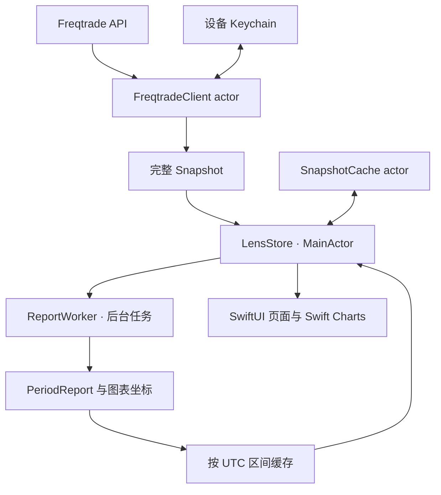
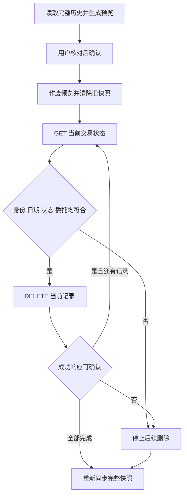

# 架构与开发

[返回首页](../README.md) · [数据与 API](DATA_AND_API.md) · [测试记录](../TESTING.md)

## 技术组成

SwiftUI 负责原生界面，Observation 驱动状态更新，Swift Charts 绘制收益图和 K 线。网络使用 URLSession，认证令牌存储在 Keychain。没有第三方运行依赖。

```text
FreqLens/
├── FreqLensApp.swift          应用入口与外观迁移
├── Core/
│   ├── APIClient.swift        URL、接口、认证、Keychain、网络与完整分页
│   ├── Models.swift           服务端模型、行情列解析与基础计算
│   ├── PeriodReport.swift     UTC 日期、筛选范围、区间统计和图表坐标
│   ├── SnapshotCache.swift    磁盘缓存 actor 与后台 ReportWorker
│   ├── LensStore.swift        主状态、服务器切换、报告缓存与删除编排
│   ├── HistoryDeletion.swift  删除预览、状态校验与结果模型
│   └── DemoData.swift         独立演示数据与行情
├── Design/Theme.swift         颜色、数字格式、卡片与公共组件
├── Views/                     页面、图表、筛选、月历与清理表单
└── Assets.xcassets/           应用图标
FreqLensTests/                 核心、网络、日期、缓存与删除测试
FreqLensUITests/               界面流程与截图
```

## 数据流



一次快照包括配置、账户指标、持仓、日收益和完整已平仓历史。全部必要请求成功后才更新视图和磁盘缓存，不把半份同步结果当成完整数据。

## 界面状态

`LensStore` 为 `@Observable @MainActor` 类型，持有当前服务器、快照、筛选、报告和独立加载状态。

- `RootView` 在前台定时刷新，场景离开活跃状态时取消轮询任务。
- 切换服务器会清空旧视图、旧报告和加载任务，使用 generation 标识拒绝旧服务器的晚到结果。
- `SnapshotCache` 在 actor 中处理 JSON 和磁盘 I/O，启动先恢复缓存再刷新服务器。
- 演示模式由 `DemoData` 提供，不向真实服务器请求行情或执行删除。

## 为什么日期切换不再重复等待网络

1. `timeFilter` 改变后，计算规范化的 UTC `PeriodKey`。
2. 内存命中则立即替换已准备的报告。
3. 未命中则启动 `ReportWorker` 的后台任务，主线程保持响应，同时注明仍显示的旧区间。
4. 完成时核对请求版本，快速切换产生的旧结果不会覆盖新选择。
5. 当前报告就绪后预先计算五个标准范围；历史变动、服务器切换或跨 UTC 日时使相关结果失效。

`PeriodReport` 一次生成统计和图表点，视图读取结果，不在每次 `body` 求值时重新汇总历史。自定义日期和月份报告共用缓存；缓存达到阈值时会清空旧项后写入新结果，不是严格 LRU。

月历使用独立月份请求 `report(for:)`，不改变全局 `timeFilter`。占位格和日期使用同一网格索引空间，避免切月后视图标识冲突。

## 历史删除流程



删除预览只能消费一次；服务器变化或重复提交会被拒绝。清理磁盘缓存失败时不会向服务器发送 DELETE。删除不确定时停止，避免自动重试造成误判。重新同步失败时保留错误状态，不恢复含已删记录的旧快照。

此功能有真实的数据修改作用，修改时需保留 [数据与 API](DATA_AND_API.md#历史清理校验) 中的前置校验和失败行为。

## 开发与验证入口

使用 Xcode 打开工程即可，没有额外生成步骤。`LensStore` 的报告生成器、缓存目录和客户端工厂可以注入；网络测试使用 URLProtocol 替代真实服务。

```bash
# 只运行核心测试
xcodebuild -project FreqLens.xcodeproj -scheme FreqLens \
  -destination 'platform=iOS Simulator,name=iPhone 17 Pro' \
  -only-testing:FreqLensTests test

# 只运行界面测试
xcodebuild -project FreqLens.xcodeproj -scheme FreqLens \
  -destination 'platform=iOS Simulator,name=iPhone 17 Pro' \
  -only-testing:FreqLensUITests test
```

UI 测试使用 `--demo`；`--tab 0/1/2/3` 可选初始页，`-appearance dark` / `-appearance light` 可用于截图。演示启动不需要任何 API 凭据，截图方法见 [截图文档](SCREENSHOTS.md#更新截图)。
