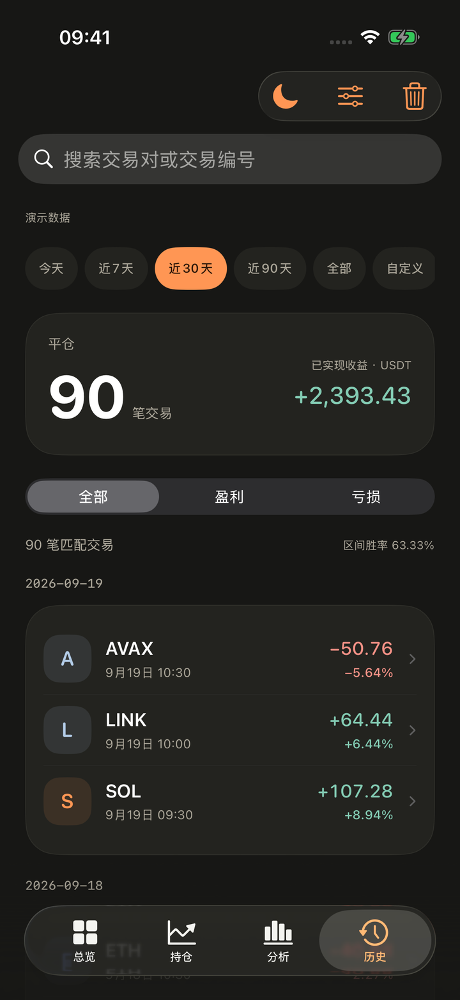
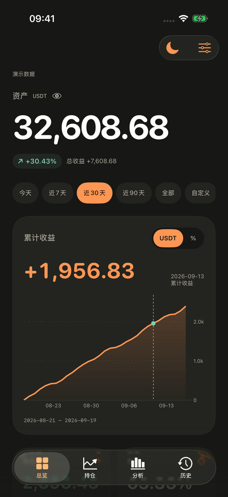
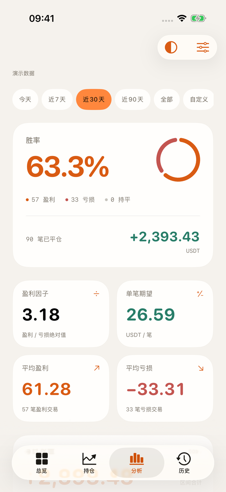
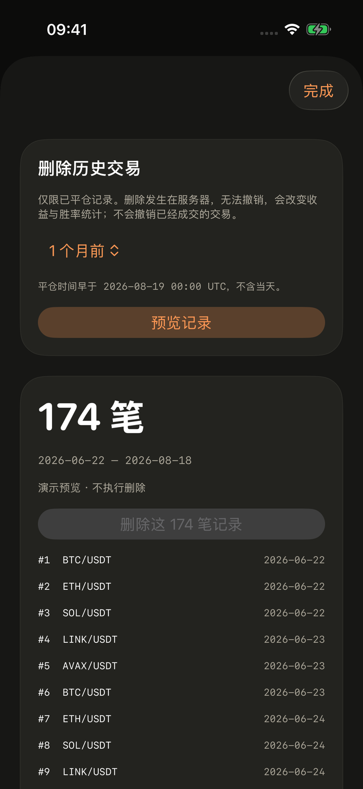

# 界面截图

[返回首页](../README.md) · [使用指南](USER_GUIDE.md)

以下截图来自 **Freq Lens 1.3（5）**，于 2026-09-20 在 iPhone 17 Pro / iOS 26.3.1 模拟器中运行 App 截取。所有金额、仓位、交易和收益均为内置演示数据。图片仅缩放至 720 px 宽并压缩，未修改界面内容。

## 四个页面

<table>
  <tr><th>总览</th><th>持仓</th></tr>
  <tr>
    <td><a href="images/overview-dark.png"></a></td>
    <td><a href="images/positions-dark.png"></a></td>
  </tr>
  <tr><th>分析</th><th>历史</th></tr>
  <tr>
    <td><a href="images/analytics-dark.png"></a></td>
    <td><a href="images/history-dark.png"></a></td>
  </tr>
</table>

## 图表与月历

<table>
  <tr><th>收益金额读数</th><th>收益百分比</th></tr>
  <tr>
    <td><a href="images/profit-readout-dark.png"></a></td>
    <td><a href="images/profit-percent-dark.png"></a></td>
  </tr>
  <tr><th>K 线读数</th><th>完整月份</th></tr>
  <tr>
    <td><a href="images/candles-dark.png"></a></td>
    <td><a href="images/calendar-dark.png"></a></td>
  </tr>
</table>

收益曲线跟随全局日期筛选。月历使用独立月份，切月不会改变上方统计区间。K 线来自当前可用行情，不保证覆盖历史交易发生时段。

## 浅色与历史清理

<table>
  <tr><th>浅色模式</th><th>历史清理预览</th></tr>
  <tr>
    <td><a href="images/analytics-light.png"></a></td>
    <td><a href="images/cleanup-preview-dark.png"></a></td>
  </tr>
</table>

清理截图只展示预览，演示模式不执行删除。真实连接中的清理会删除服务器已平仓记录，操作前请阅读 [历史清理说明](USER_GUIDE.md#历史清理)。

## 更新截图

截图资源位于 `docs/images/`，文件名按页面和外观命名。`Preview/` 仅用于本机检查且已被 Git 忽略，不应直接整体上传。

### 使用 UI 测试

在仓库根目录运行；设备名使用本机实际可用的模拟器。结果包路径必须尚不存在，重复运行时另选名称。

```bash
xcodebuild -project FreqLens.xcodeproj -scheme FreqLens \
  -destination 'platform=iOS Simulator,name=iPhone 17 Pro' \
  -resultBundlePath DerivedData/Screenshots.xcresult \
  -only-testing:FreqLensUITests test

xcrun xcresulttool export attachments \
  --path DerivedData/Screenshots.xcresult \
  --output-path DerivedData/ScreenshotAttachments
```

导出目录的 `manifest.json` 对应测试名称、附件名称和实际文件名。UI 测试使用 `--demo`，覆盖导航、深浅色、拖动读数、月历及历史清理预览。

| 图片 | 对应测试附件 |
| --- | --- |
| `overview-dark.png` | `01-overview` |
| `positions-dark.png` | `02-positions` |
| `analytics-dark.png` | `04-analytics` |
| `history-dark.png` | `05-history` |
| `profit-percent-dark.png` | `14-profit-percent-readout` |
| `profit-readout-dark.png` | `07-dark-chart-selection` |
| `candles-dark.png` | `09-dark-candle-selection` |
| `analytics-light.png` | `11-warm-analytics` |
| `calendar-dark.png` | `12-previous-month-calendar` |
| `cleanup-preview-dark.png` | `13-deletion-preview-demo` |

### 手动补图

可在 Xcode 的 Run scheme arguments 中添加 `--demo`，用 `--tab 0`、`1`、`2`、`3` 指定总览、持仓、分析、历史，用 `-appearance dark` 或 `-appearance light` 指定外观。

截图前确认正在展示演示数据；不要打开可能含真实服务器配置的连接页。等待统计加载完成，再通过模拟器的截图功能保存。保留真实界面和必要状态说明，不替换图中的金额或交易记录。

提交前逐张核对文字、图表读数、月份星期对齐与深浅色，保持长宽比，并更新本页的版本和日期。
